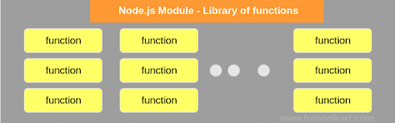

### Overview

In programming, modules are self-contained units of functionality that can be shared and reused across projects. They make our lives as developers easier, as we can use them to augment our applications with functionality that we haven’t had to write ourselves. They also allow us to organize and decouple our code, leading to applications that are easier to understand, debug and maintain. In this section we will understand how to work with node js modules.

### Learning Outcome
- What are Node.js modules?
- What are Built-in Modules?
- How to use External Modules?
- How to create a module and use them in your project?
- How are modules resolved in Node.js?

### Introduction

- Modules are a crucial concept to understand Node.js projects and is a first class concept in Node.
- Node.js Module is a library of functions that could be used in a Node.js file.

     

- In simple terms, a Node module is basically a Javascript file. So lets say if you are creating a file calculator.js, you are basically creating a node.js module. 

### There are Types of Module

1. Core module: Modules that come shipped with Node.js, e.g. https, os, fs, net, etc.

2. Third-party module or external modules: Modules that you install from any package manager. We use these modules to accomplish or simplify any existing task. For example, to simplify our web API development we use express, or to deal with date and time we use moment.

4. Local module: These are the modules that we create for our own use. These modules basically consist of core business logic of our code.

   
### What you must do

#### Additional Resources

