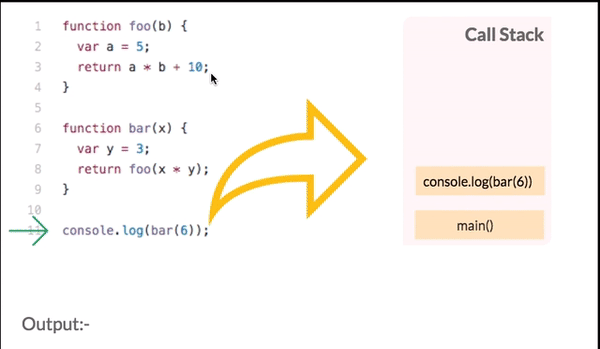

### Overview
In last chapter we leant about Asynchronous program. In this section we will see how the internal of how asychronous code executes. 
Also introduces you to few concepts related to asynchronous programming in Node like callstacks, callbacks, event loops and Promises.

### Learning Outcome
- What is a Callstack?
- What is Event loop?
- How to handle Asynchronous code using callbacks and promises?

### Introduction
- In the last chapter we saw an example of setTimeout to make code block asynchronous.
    ```
    console.log("Start executing the code.");
    setTimeout(() => {
        console.log("First.");
    }, 1000);

    console.log("Second.");
    ```
    Output:
    ```
    Start executing the code.
    First.
    Second.
    ```

    You must be wondering how does the 1 minute setTimeout delay not prevent the rest of the code from executing. To understand this let us understand the concept of Event loop.

    

- The event loop is in the heart of Node.js / Javascript - it is responsible for scheduling asynchronous operations.
- Let us understand each term in the diagram above with examples
    - Callstack: 
        - At the most basic level, a call stack is a data structure that uses the Last In, First Out (LIFO) principle to temporarily store and manage function invocation
        - This is where all your javascript code gets pushed and executed one by one as the interpreter reads your program, and gets popped out once the execution is done. If your statement is asynchronous: setTimeout, ajax(), promise, or click event, then that code gets removed from Main Stack and forwarded to Event table, this table is responsible for moving your asynchronous code to callback/event queue after specified time.

            

    - Heap - This is where all the memory allocation happens for your variables, that you have defined in your program.
    - Callback Queue: This is where your asynchronous code gets pushed to, and waits for the execution.
    - Event Loop: Then comes the Event Loop, which keeps running continuously and checks the Main stack if it has any frames to execute, if not then it checks Callback queue, if Callback queue has codes to execute then it pops the message from it to the Main Stack for the execution.

### What you must do
- Learn more about [callstacks](https://www.javascripttutorial.net/javascript-call-stack/) with examples.
- Watch this video which explains [Event loop](https://www.youtube.com/watch?v=8aGhZQkoFbQ&t=7s) in detail.
- Read [How Node and Javascript handle asynchronous functions](https://medium.com/@thejasonfile/how-node-and-javascript-handle-asynchronous-functions-7feb9fc8a610)


#### Additional Resources
- Watch this video which explains [About the Call Stack, Event Loop, Callbacks and Promises in JavaScript](https://www.youtube.com/watch?v=RRgAdi3gX-s)


