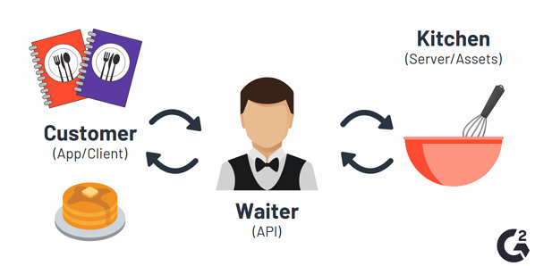

### Overview
Have you ever wondered how multiple applications interact with and obtain data from one another? How amazon fetches the list of products to be displayed to the users? How instagram fetch your feed information? or whenever you add something to the cart in any shopping website, how is that data sent to the backend? The answer to all this question is an API. 

There is no way there can be a profound discussion on server side programming without involving API's in it. This section introduces you to API's and gives you an insight into how it is a bridge between server and client. 

### Learning Outcome
- What is an API?
- Why is it important for communation between client and server?
- Types of API?
- What is a REST API?

### Introduction
#### API
- API is the acronym for Application Programming Interface, which is a software intermediary that allows two applications to talk to each other. 
- In other words, an API is the messenger that delivers your request to the provider that you’re requesting it from and then delivers the response back to you.

    

- The API is the set of methods that we will handle on the server. It’s our own personal protocol for communicating between the client and the server. Once we have our API defined, it doesn't matter what is running on the server or who the clients are.

    

- Each time you use an app like instagram, airbnb, makemytrip etc send an instant message, or check hotel availability on your phone/website, you’re using an API.
- Let us look at a very common example use to explain what API is 
    - You go to a restaurant you sit at your table and you choose that you need ABC. You will have your waiter coming up and taking a note of what you want. You tell him that you want ABC. So, you are requesting ABC, the waiter responds back with ABC he gets in the kitchen and serves you the food. In this case, who is your interface in between you and the kitchen is your waiter. It’s his responsibility to carry the request from you to the kitchen, make sure it’s getting done, and you know once it is ready he gets back to you as a response.

    

- Take a look at a real life example [here](https://www.mulesoft.com/resources/api/what-is-an-api).

#### REST and RESTful API's
- REST is an architectural style, or design pattern, for APIs.
- REST uses client-server model, where the server is an HTTP server and the client sends HTTP verbs(GET, PUT, POST, DELETE) along with a URL and path parameters that are URL encoded.
- This blog explains [what is REST](https://medium.com/extend/what-is-rest-a-simple-explanation-for-beginners-part-1-introduction-b4a072f8740f) in detail. 
- Learn about [Rest API](https://www.youtube.com/watch?v=qVTAB8Z2VmA)
- We will see how to build RESTful API's in Node in the Express topic of this sprint.

### What you must do
- Learn about [What exactly is an API](https://www.youtube.com/watch?v=s7wmiS2mSXY).
- This article explains [How APIs work](https://medium.com/@tyteen4a03/how-apis-work-an-analogy-for-dummies-ac6ee1d1671b) in simple terms.
- Read about [How it helps client server communication](https://www.youtube.com/watch?v=B9vPoCOP7oY).
- Read [What is an API and why are they important to developers?](https://medium.com/@mandeepkaur1/what-is-an-api-and-why-are-they-important-to-developers-98ad18d45b93).
- Further watch this video about [APIs | REST | REST APIs](https://www.youtube.com/watch?v=FOZtRzY5x8E)
- Learn more about [What is a RESTful API?](https://www.youtube.com/watch?v=0oXYLzuucwE&list=PL55RiY5tL51q4D-B63KBnygU6opNPFk_q)
- Acquaint yourself with [REST API concepts](https://www.youtube.com/watch?v=7YcW25PHnAA)
- Learn [how to use REST API](https://stackify.com/rest-api-tutorial/)
- Further [Read about how to design API](https://docs.microsoft.com/en-us/azure/architecture/best-practices/api-design)
- This one is must read [This explains Rest API along with some examples](https://www.codecademy.com/articles/what-is-rest)
- Great [video](https://www.youtube.com/watch?v=rhTkRK53XdQ) on what each of the GET, PUT, POST and DELETE method does and when to use each one.

#### Additional Resources
- Further take a look on another take on [How API's work](https://blogs.mulesoft.com/biz/tech-ramblings-biz/what-are-apis-how-do-apis-work/).
- Read [What is REST API? | REST API Tutorial | REST API Concepts and Examples](https://www.youtube.com/watch?v=rtWH70_MMHM)
- Watch this video about [how to use an API](https://www.youtube.com/watch?v=GZvSYJDk-us&t=3756s). Watch only till 1:15hrs, skip the part after that.