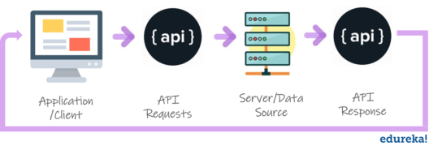
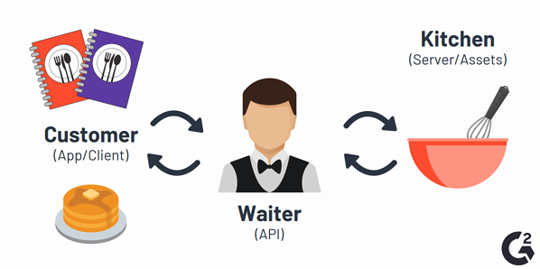

### Overview
There is no way there can be a profound discussion on server side programming without involving API's in it. This section introduces you to API's and gives you an insight into how it is a bridge between server and client.

### Learning Outcome
- What is an API?
- Why is it important for communation between client and server?

### Introduction
- API is the acronym for Application Programming Interface, which is a software intermediary that allows two applications to talk to each other. 
- In other words, an API is the messenger that delivers your request to the provider that you’re requesting it from and then delivers the response back to you.

    

- Each time you use an app like instgram, airbnb, makemytrip etc send an instant message, or check hotel availibility on your phone/website, you’re using an API.
- Let us look at a very common example use to explain what API is 
    - You go to a restaurant you sit at your table and you choose that you need ABC. You will have your waiter coming up and taking a note of what you want. You tell him that you want ABC. So, you are requesting ABC, the waiter responds back with ABC he gets in the kitchen and serves you the food. In this case, who is your interface in between you and the kitchen is your waiter. It’s his responsibility to carry the request from you to the kitchen, make sure it’s getting done, and you know once it is ready he gets back to you as a response.

    

- Take a look at a real life example [here](https://www.mulesoft.com/resources/api/what-is-an-api).

### What you must do
- Learn about [What exactly is an API](https://www.youtube.com/watch?v=s7wmiS2mSXY).
- This article explains [How APIs work](https://medium.com/@tyteen4a03/how-apis-work-an-analogy-for-dummies-ac6ee1d1671b) in simple terms.
- Read about [How it helps client server communication](https://www.youtube.com/watch?v=B9vPoCOP7oY).
- Read [What is an API and why are they important to developers?](https://medium.com/@mandeepkaur1/what-is-an-api-and-why-are-they-important-to-developers-98ad18d45b93).

#### Additional Resources
- Further take a look on another take on [How API's work](https://blogs.mulesoft.com/biz/tech-ramblings-biz/what-are-apis-how-do-apis-work/).

