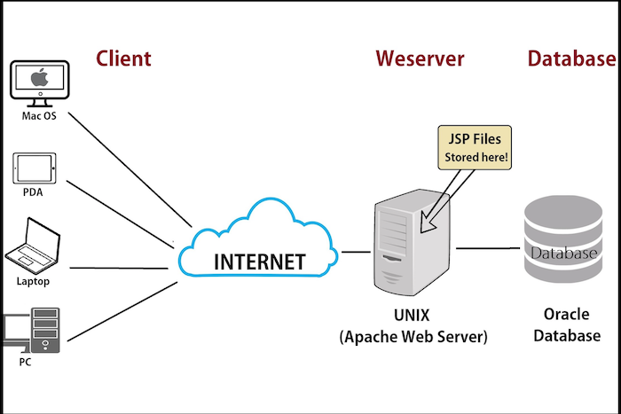

### Overview
This chapter introduces to web servers. So far whatever applications we have created have been only accessible via command line. But it is will very practial if the user can open a url in a browser and interact with our application. This is where web servers come into picture.

### Learning Outcome
- What is a Web server?

### Introduction
- A web server stores and delivers the content for a website – such as text, images, video, and application data – to clients that request it. 
- Many people familiar with how to view and navigate web pages, but have limited knowledge of how those web pages do what they do. 
-  When someone sits down at a computer and enters an address into an internet browser like Internet Explorer or Firefox, the browser sends a request off into the internet asking to view the web page found at that address. 
- The web server is the program or machine that responds to that request, and delivers the content of the page back to the user.
- A web server communicates with a web browser using the Hypertext Transfer Protocol (HTTP). The content of most web pages is encoded in Hypertext Markup Language (HTML). 

    

### What you must do
- Dive deep into [What is a web server](https://developer.mozilla.org/en-US/docs/Learn/Common_questions/What_is_a_web_server)

#### Additional Resources
- Read about [How web servers work](https://www.geeksforgeeks.org/web-servers-work/).
- Further take a look on another take on [What are web servers and how do they work (with examples httpd and nodejs)](https://www.youtube.com/watch?v=JhpUch6lWMw)