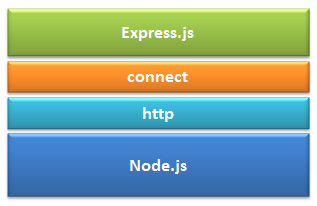

### Overview
In this section we will be going through one of the most popular web framework, written in JavaScript and hosted within the Node.js runtime environment i.e Express. We will also see how to set up our first express server.

### Learning Outcome
- What is Express?
- Why use Express?
- How to set up our first Express Server?

### Introduction
- Why use a web framework.
As MDN has described this - Other common web-development tasks are not directly supported by Node itself. If you want to add specific handling for different HTTP verbs (e.g. GET, POST, DELETE, etc.), separately handle requests at different URL paths ("routes"), serve static files, or use templates to dynamically create the response, Node won't be of much use on its own. You will either need to write the code yourself, or you can avoid reinventing the wheel and use a web framework.
- Express is a minimal, open source and flexible Node.js web app framework designed to make developing websites, web apps, & API’s much easier.
- It provides various features that make web application development fast and easy which otherwise takes more time using only Node.js. 
- In short, ExpressJS did for NodeJS what Bootstrap did for HTML/CSS and responsive web design. It made coding in NodeJS a piece of cake and gave programmers some additional features to extend their server-side coding. 
- Express.js is based on the Node.js middleware module called connect which in turn uses http module. So, any middleware which is based on connect will also work with Express.js.

    

#### Setting your Express Server
1. Installing & using Express
- You can get it through NPM. Go the terminal and inside and project folder execute the command bellow:
```
npm install express --save
```

2. Create Basic express app: 
- Step 1: Paste the following code in your server.js or main application file:
```js
    const express = require('express');
    var app = express();
    app.get('/', (req, res) => {
        res.send('My first Express app')
    });
    app.listen(process.env.PORT || 3000);
```
What does the above code block mean - 
Line 1: We are importing Express like we would import any external/ third-party module using require.
Line 2: We are creating the express app by setting it to the app variable.
Line 3: app.get is saying that when it gets that route it should give the response that is specified in the function. It takes in 2 arguments: 
    - (1) the url or the route 
    - (2) the function that tells express what to send back to the person making the request. req is the request that the user has send and using res i.e response we send back the response to the user. res.send means you are sending the response.
Line 5: app.listen is going to bind the application to the port on our machine. This the port what you application will run.

- Step 2:  Run you server.js file
```
 node server.js
```

- Step 3: Step 6: Go to your browser and go to port 3000. 
```
http://localhost:3000/
```
You should see “My first Express app” on the webpage.


### What you must do
- Read [how to install express](https://expressjs.com/en/starter/installing.html) on the official documentation.
- Before starting the next chapter it is important to understand [What is Routing](https://expressjs.com/en/starter/basic-routing.html).
- Read about [Routing, Route methods, Route paths, Route parameters](https://expressjs.com/en/guide/routing.html)
- Read [Express/Node introduction](https://developer.mozilla.org/en-US/docs/Learn/Server-side/Express_Nodejs)
- Read a blog on [Why use ExpressJS over NodeJS for Server-Side Development?](https://www.algoworks.com/blog/why-use-expressjs-over-nodejs-for-server-side-coding/)


